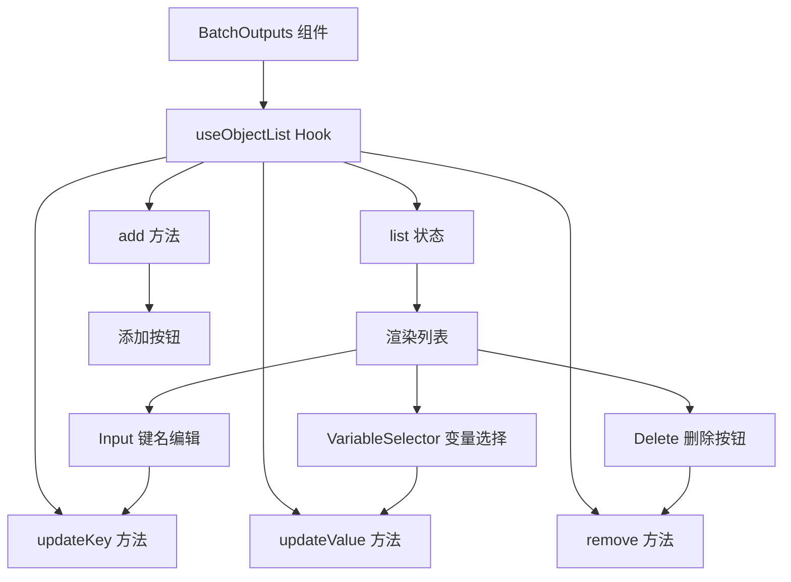

import { SourceCode } from '@theme';
import { BasicStory, ReadonlyStory } from 'components/form-materials/components/batch-outputs';

# BatchOutputs

`BatchOutputs` 是一个用于配置循环输出的键值对编辑器组件。在循环节点场景中，它允许用户定义每次迭代需要收集的输出值，这些值最终会被聚合成数组。

:::warning

`BatchOutputs` 必须搭配 `batchOutputsPlugin` 副作用使用，才能正常工作。

:::

主要功能：
- **动态添加/删除输出项**：用户可以自由添加或删除输出键值对
- **键名编辑**：为每个输出定义一个唯一的键名
- **变量引用**：通过变量选择器引用循环体内可用的变量

## 案例演示

### 基本使用

<BasicStory />

```tsx pure title="form-meta.tsx"
import { FormRenderProps, FlowNodeJSON, Field, FormMeta } from '@flowgram.ai/free-layout-editor';
import {
  BatchOutputs,
  BatchVariableSelector,
  createBatchOutputsFormPlugin,
  IFlowRefValue,
  provideBatchInputEffect,
} from '@flowgram.ai/form-materials';

interface LoopNodeJSON extends FlowNodeJSON {
  data: {
    loopFor: IFlowRefValue;
  };
}

export const LoopFormRender = ({ form }: FormRenderProps<LoopNodeJSON>) => {
  return (
    <>
      <FormHeader />
      <FormContent>
        <Field<IFlowRefValue> name="loopFor">
          {({ field, fieldState }) => (
            <FormItem name="loopFor" type="array" required>
              <BatchVariableSelector
                style={{ width: '100%' }}
                value={field.value?.content}
                onChange={(val) => field.onChange({ type: 'ref', content: val })}
                hasError={Object.keys(fieldState?.errors || {}).length > 0}
              />
            </FormItem>
          )}
        </Field>
        <Field<Record<string, IFlowRefValue | undefined> | undefined> name="loopOutputs">
          {({ field, fieldState }) => (
            <FormItem name="loopOutputs" type="object" vertical>
              <BatchOutputs
                style={{ width: '100%' }}
                value={field.value}
                onChange={(val) => field.onChange(val)}
                hasError={Object.keys(fieldState?.errors || {}).length > 0}
              />
            </FormItem>
          )}
        </Field>
      </FormContent>
    </>
  );
};

export const formMeta: FormMeta = {
  render: LoopFormRender,
  effect: {
    loopFor: provideBatchInputEffect,
  },
  plugins: [createBatchOutputsFormPlugin({ outputKey: 'loopOutputs', inferTargetKey: 'outputs' })],
};
```


## API 参考

### BatchOutputs Props

| 属性名 | 类型 | 默认值 | 描述 |
|--------|------|--------|------|
| `value` | `Record<string, IFlowRefValue \| undefined>` | - | 输出键值对对象，键为输出名称，值为变量引用 |
| `onChange` | `(value?: Record<string, IFlowRefValue \| undefined>) => void` | - | 值变化时的回调函数 |
| `readonly` | `boolean` | `false` | 是否为只读模式 |
| `hasError` | `boolean` | `false` | 是否显示错误状态 |
| `style` | `React.CSSProperties` | - | 自定义样式 |

### 值类型说明

```typescript
type ValueType = Record<string, IFlowRefValue | undefined>;

interface IFlowRefValue {
  type: 'ref';
  content?: string[];  // 变量路径数组，如 ['nodeId', 'fieldName']
}
```

## 源码导读

<SourceCode
  href="https://github.com/bytedance/flowgram.ai/tree/main/packages/materials/form-materials/src/components/batch-outputs"
/>

使用 CLI 命令可以复制源代码到本地：

```bash
npx @flowgram.ai/cli@latest materials components/batch-outputs
```

### 目录结构讲解

```
batch-outputs/
├── index.tsx          # 主组件实现
├── types.ts           # 类型定义
└── styles.css         # 样式文件
```

### 核心实现说明

#### 组件结构

BatchOutputs 组件基于 `useObjectList` hook 实现动态列表管理，每一行包含：
- **Input**：用于编辑输出键名
- **InjectVariableSelector**：用于选择变量引用
- **Delete Button**：删除当前行

#### 整体流程



#### useObjectList Hook

`useObjectList` 是一个通用的动态对象列表管理 hook，核心功能：

1. **列表状态管理**：维护带有唯一 ID 的列表项
2. **双向同步**：在 `value` 属性变化时同步更新列表
3. **增删改操作**：提供 `add`、`remove`、`updateKey`、`updateValue` 方法

```typescript
const { list, add, updateKey, updateValue, remove } = useObjectList({
  value,      // 外部传入的对象值
  onChange,   // 值变化回调
});
```

### 依赖梳理

#### flowgram API

[**@flowgram.ai/editor**](https://github.com/bytedance/flowgram.ai/tree/main/packages/client/editor)
- [`I18n`](https://flowgram.ai/auto-docs/editor/modules/I18n): 国际化工具，用于按钮文案

#### 依赖的其他物料

[**useObjectList**](https://github.com/bytedance/flowgram.ai/tree/main/packages/materials/form-materials/src/hooks/use-object-list)
- 动态对象列表管理 hook，处理列表的增删改操作

[**InjectVariableSelector**](./variable-selector)
- 注入式变量选择器，用于选择变量引用

#### 第三方依赖

- `@douyinfe/semi-ui`: UI 组件库，使用 Button、Input 组件
- `@douyinfe/semi-icons`: 图标库，使用 IconDelete、IconPlus 图标

## 相关物料

- [BatchVariableSelector](./batch-variable-selector): 数组变量选择器，用于选择循环输入
- [provideBatchInput](../effects/provide-batch-input): 循环输入变量解析副作用
- [batchOutputsPlugin](../form-plugins/batch-outputs-plugin): 循环输出插件，处理作用域链和类型推导
