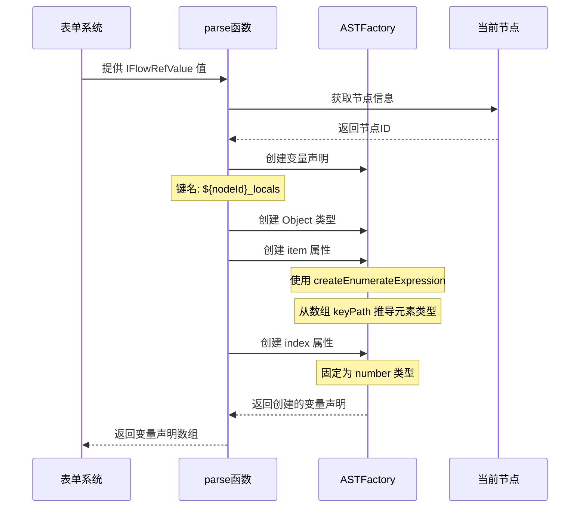

import { SourceCode } from '@theme';
import { BasicStory } from 'components/form-materials/effects/provide-batch-input';

# provideBatchInput

provideBatchInput 是一个表单副作用，专门用于循环节点场景。它能够将循环输入的数组变量解析为两个局部变量：

- **item**：当前迭代的数组元素，类型会根据输入数组的元素类型自动推导
- **index**：当前迭代的索引，类型为 number

这使得循环体内的子节点可以引用 `item` 和 `index` 变量，实现对数组元素的逐个处理。

## 案例演示

### 基本使用

:::tip

选择一个数组类型的变量后，`provideBatchInputEffect` 会自动生成 `item` 和 `index` 局部变量，可以在下方的变量选择器中看到这些变量。

:::

<BasicStory />

```tsx pure title="form-meta.tsx"
import { FormRenderProps, FlowNodeJSON, Field, FormMeta } from '@flowgram.ai/free-layout-editor';
import {
  BatchOutputs,
  BatchVariableSelector,
  createBatchOutputsFormPlugin,
  IFlowRefValue,
  provideBatchInputEffect,
} from '@flowgram.ai/form-materials';

interface LoopNodeJSON extends FlowNodeJSON {
  data: {
    loopFor: IFlowRefValue;
  };
}

export const LoopFormRender = ({ form }: FormRenderProps<LoopNodeJSON>) => {
  return (
    <>
      <FormHeader />
      <FormContent>
        <Field<IFlowRefValue> name="loopFor">
          {({ field, fieldState }) => (
            <FormItem name="loopFor" type="array" required>
              <BatchVariableSelector
                style={{ width: '100%' }}
                value={field.value?.content}
                onChange={(val) => field.onChange({ type: 'ref', content: val })}
                hasError={Object.keys(fieldState?.errors || {}).length > 0}
              />
            </FormItem>
          )}
        </Field>
        <Field<Record<string, IFlowRefValue | undefined> | undefined> name="loopOutputs">
          {({ field, fieldState }) => (
            <FormItem name="loopOutputs" type="object" vertical>
              <BatchOutputs
                style={{ width: '100%' }}
                value={field.value}
                onChange={(val) => field.onChange(val)}
                hasError={Object.keys(fieldState?.errors || {}).length > 0}
              />
            </FormItem>
          )}
        </Field>
      </FormContent>
    </>
  );
};

export const formMeta: FormMeta = {
  render: LoopFormRender,
  effect: {
    loopFor: provideBatchInputEffect,
  },
  plugins: [createBatchOutputsFormPlugin({ outputKey: 'loopOutputs', inferTargetKey: 'outputs' })],
};
```

## API 参考

### provideBatchInputEffect

提供一个表单副作用，将循环输入的数组变量解析为 `item` 和 `index` 局部变量。

#### 参数
- 无直接参数，作为表单副作用直接使用在 formMeta.effect 中

#### 返回值
- `EffectOptions[]`: 表单副作用选项数组，用于 formMeta.effect 配置

#### 生成的变量结构

副作用会在当前节点作用域下创建一个私有变量 `${nodeId}_locals`，结构如下：

| 字段 | 类型 | 描述 |
|------|------|------|
| `item` | 根据数组元素类型推导 | 当前迭代的数组元素 |
| `index` | `number` | 当前迭代的索引 |

## 源码导读

<SourceCode
  href="https://github.com/bytedance/flowgram.ai/tree/main/packages/materials/form-materials/src/effects/provide-batch-input/index.ts"
/>

使用 CLI 命令可以复制源代码到本地：

```bash
npx @flowgram.ai/cli@latest materials effects/provide-batch-input
```

### 目录结构讲解

```
provide-batch-input/
└── index.ts           # 主实现文件，导出 provideBatchInputEffect 表单副作用
```

### 核心实现说明

#### 变量生成逻辑

provideBatchInputEffect 使用 [`createEffectFromVariableProvider`](/guide/variable/variable-output) 工厂函数创建变量提供器。核心特点：

1. **私有变量**：设置 `private: true`，生成的变量仅在当前节点作用域内可见
2. **元素类型推导**：使用 `ASTFactory.createEnumerateExpression` 从数组类型推导出元素类型
3. **索引变量**：固定为 `number` 类型

#### 变量生成流程时序图



#### 关键代码解析

```typescript
export const provideBatchInputEffect: EffectOptions[] = createEffectFromVariableProvider({
  private: true,  // 标记为私有变量
  parse: (value: IFlowRefValue, ctx) => [
    ASTFactory.createVariableDeclaration({
      key: `${ctx.node.id}_locals`,  // 变量键名
      meta: {
        title: ctx.node.form?.getValueIn('title'),
        icon: ctx.node.getNodeRegistry<FlowNodeRegistry>().info?.icon,
      },
      type: ASTFactory.createObject({
        properties: [
          // item: 从数组类型推导元素类型
          ASTFactory.createProperty({
            key: 'item',
            initializer: ASTFactory.createEnumerateExpression({
              enumerateFor: ASTFactory.createKeyPathExpression({
                keyPath: value.content || [],
              }),
            }),
          }),
          // index: 固定为 number 类型
          ASTFactory.createProperty({
            key: 'index',
            type: ASTFactory.createNumber(),
          }),
        ],
      }),
    }),
  ],
});
```

### 依赖梳理

#### flowgram API

[**@flowgram.ai/editor**](https://github.com/bytedance/flowgram.ai/tree/main/packages/client/editor)
- [`EffectOptions`](https://flowgram.ai/auto-docs/editor/types/EffectOptions): 表单副作用选项类型
- [`FlowNodeRegistry`](https://flowgram.ai/auto-docs/document/interfaces/FlowNodeRegistry-1): 节点注册类型定义
- [`createEffectFromVariableProvider`](/guide/variable/variable-output): 从变量提供器创建表单副作用的工厂函数

[**@flowgram.ai/variable-core**](https://github.com/bytedance/flowgram.ai/tree/main/packages/variable-engine/variable-core)
- [`ASTFactory`](https://flowgram.ai/auto-docs/editor/modules/ASTFactory): AST 创建工厂，用于生成变量声明
- `ASTFactory.createEnumerateExpression`: 创建枚举表达式，用于从数组类型推导元素类型
- `ASTFactory.createKeyPathExpression`: 创建键路径表达式，用于引用变量路径

#### 依赖的其他物料

[**BatchVariableSelector**](../components/batch-variable-selector)
- 用于选择数组类型的变量，配合 `provideBatchInputEffect` 使用
